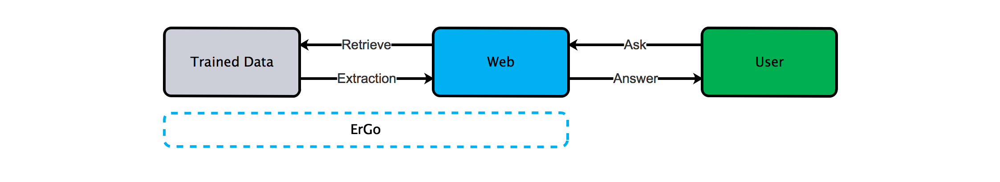
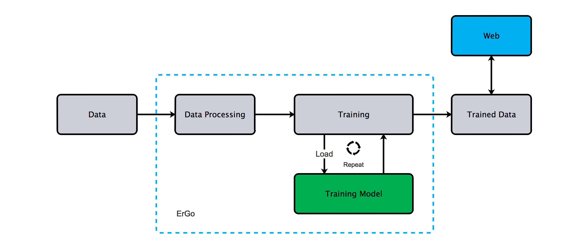

# [云框架]TensorFlow


[](CONTRIBUTORS.md)


[TensorFlow](https://www.tensorflow.org/)是Google开源的人工智能（Machine Intelligence）软件库，更具体来说，TensorFlow是使用数据流图（[Data Flow Graphs](http://web.cecs.pdx.edu/~mperkows/temp/JULY/data-flow-graph.pdf)）进行数值计算的开源软件库。**Tensor**（[张量](https://en.wikipedia.org/wiki/Tensor)）指的是在节点间相互联系的多维数据数组，**Flow**（流）指基于数据流图的计算。TensorFlow架构灵活，小到智能手机，大到数据中心服务器均可展开计算，同时具备很强的通用性，适用于包括图形分类、音频处理、推荐系统和自然语言处理等在内的各种计算领域。

TensorFlow具备以下特点——

* 灵活（Deep Flexibility）：支持任何数据流图计算
* 便携（True Portability）：支持各类计算设备
* 链接科研和产品（Connect Research and Product）：加速研究成果转化为实际产品
* 自动化微分运算（Auto-Differentiation）：帮助机器学习算法自动求出梯度
* 多语言（Language Options）：利用python构建和执行计算图，支持C++的语言，未来将支持Lua、JavaScript、R等
* 性能优化（Maximize Performance）：支持线程、队列、异步计算，并根据需要分配计算元素

自15年年底开源以来，TensorFlow迅速流行，除了Google自己，Airbnb、Snapchat、eBay、Twitter等知名公司纷纷加入到TensorFlow的使用者阵营当中。

本篇[云框架](ABOUT.md)将以**ErGo**（一款基于TensorFlow的Chatbot）为例介绍TensorFlow实践。

# 内容概览

* [快速部署](#快速部署)
* [框架说明-业务](#框架说明-业务) 
* [框架说明-组件](#框架说明-组件)
    * [输入](#输入)
    * [处理](#处理)
        * [模型](#模型)
        * [训练](#训练)
    * [输出](#输出)
* [更新计划](#更新计划)
* [社群贡献](#社群贡献)

# <a name="快速部署"></a>快速部署

## 一键部署

[一键部署在好雨云平台](http://app.goodrain.com/group/detail/30/)

## 本地部署

1.Git clone

    ```
    git clone https://github.com/cloudframeworks-tensorflow/ErGo
    ```

2.执行如下命令，进行相关的？

    ```
    python main.py --train
    ```

3.查看训练效果

    ```python
    docker build -t ergo -f Dockerfile.cpu .
    redis-server &
    docker run -itd -p 8000:8000 --name ergo ergo
    ```

4.访问对话页面

    ```
    http://localhost:8000
    ```

其中 learningRate和dropout这两个参数对训练的效果有着直接影响.

# <a name="业务说明"></a>业务说明

聊天机器人（Chatbot）——**ErGo**，基于TensorFlow实现，可与用户互动完成智能对话。

工作流程如下图所示：

<div align=center></div>

* 流程包括提问（Ask）、检索（Retrieve）、抽取（Extraction）、回答（Answer）4部分
* 用户通过界面（Web）提问后，ErGo将在已训练好的数据（Trained Data）中检索并抽取回答
* 抽取回答后通过界面反馈给用户

# <a name="技术流程"></a>技术流程

ErGo技术流程整体可分为**输入**、**处理**（包括模型及训练）、**输出**三部分，如下图所示：

<div align=center></div>

分点解释上图流程 @ysicing

## <a name="输入"></a>输入

与例子结合解释 @ysicing

## <a name="处理"></a>处理

与例子结合解释 @ysicing

### <a name="模型"></a>模型

与例子结合解释 @ysicing

### <a name="训练"></a>训练

与例子结合解释 @ysicing

*建议利用GPU环境进行训练*

## <a name="输出"></a>输出

与例子结合解释 @ysicing

## <a name="如何变成自己的项目">如何变成自己的项目

* 替换训练数据
* 替换展示界面

理论上只需提供自己项目相关的训练数据即可，后期会支持相关api接口调用。

# <a name="更新计划"></a>更新计划

* `训练` 支持云平台训练 
* `展示界面` 提供API接口
* `展示界面` 通过微信展示 

点击查看[历史更新](CHANGELOG.md)

# <a name="社群贡献"></a>社群贡献

+ QQ群: 621870673
+ [参与贡献](CONTRIBUTING.md)
+ [联系我们](mailto:info@goodrain.com)

-------

[云框架](ABOUT.md)系列主题，遵循[APACHE LICENSE 2.0](LICENSE.md)协议发布。

